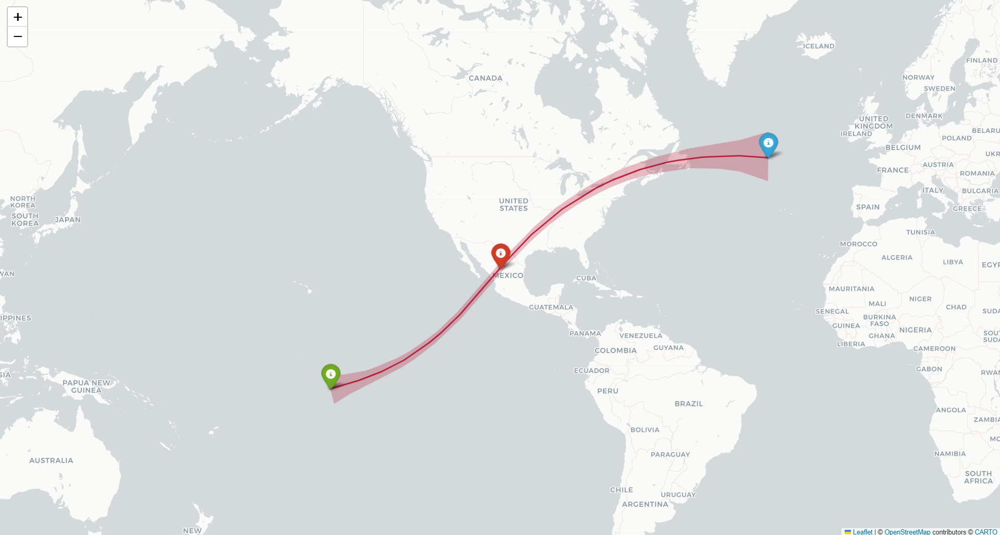

# umbra

**A high-precision eclipse prediction engine.** Given any location on Earth and
any date across four centuries, umbra computes which solar and lunar eclipses are
visible, what kind they are, when they happen, and — for solar eclipses — traces
the path of totality across the globe. Every result is derived from JPL planetary
ephemerides and first-principles shadow geometry, not looked up from a table.



*The 8 April 2024 total solar eclipse: the band of totality computed by umbra —
from landfall in the South Pacific (green), through greatest eclipse over Mexico
(red), to sunset over the North Atlantic (blue).*

## What it does

- **Finds every eclipse**, solar and lunar, in a date range, straight from a JPL ephemeris.
- **Classifies each one**: lunar as penumbral / partial / total; solar as partial / annular / hybrid / total.
- **Computes contact times** — the seven moments (P1 · U1 · U2 · greatest · U3 · U4 · P4) that mark a lunar eclipse's progress.
- **Answers "what will I see?"** for any location: whether an eclipse is visible, its magnitude, and — for solar totality or annularity — how long it lasts.
- **Traces the path of totality** for solar eclipses and renders it as an interactive map: centreline and full shadow band.

## How it works

umbra separates expensive computation from fast lookup:

- An **offline pipeline** walks the ephemeris once, finds and classifies every eclipse, and freezes the results into a small SQLite catalogue — a few megabytes for centuries of eclipses.
- A **runtime layer** answers location queries in milliseconds by reading that catalogue and doing a little geometry, with no ephemeris access per query.

The astronomy is built up from vectors and first principles:

- **Lunar eclipses** are found as maxima of the Sun–Moon angle (Full Moons) and classified by comparing the Moon's distance from Earth's shadow axis against the umbra and penumbra radii.
- **Solar eclipses** are found as minima of the Sun–Moon angle (New Moons); the shadow axis is intersected with Earth's WGS84 **ellipsoid** to place the shadow on the ground, and the umbral cone geometry gives the path width.
- **Local circumstances** come from the topocentric overlap of the Sun and Moon discs, as the observer actually sees them.

This follows the same shadow-cone geometry as the classical **Besselian element**
method, computed directly with modern vectors on top of the
[Skyfield](https://rhodesmill.org/skyfield/) astronomy library rather than the
traditional tabulated elements.

## Accuracy

Every stage is validated against the published eclipse record. For the
8 April 2024 total solar eclipse:

| Quantity | umbra | Published |
|---|---|---|
| gamma | 0.343 | 0.3431 |
| Greatest-eclipse point | 25.29°N, 104.15°W | 25.29°N, 104.13°W |
| Path width | 200 km | ~197 km |
| Totality at Mazatlán | 4m 20s | 4m 20s |
| Totality at Dallas | 3m 53s | 3m 52s |

Greatest-eclipse coordinates match to within a few hundredths of a degree, and
totality durations to the second.

## Install

```bash
pip install -r requirements.txt
```

`skyfield-data` bundles a de421 ephemeris (covering 1899–2053), so umbra runs with
no manual downloads.

## Usage

Build the lunar catalogue once, then query it for a location:

```bash
# build the catalogue
python scripts/build_catalog.py --start 2000 --end 2050

# lunar eclipses visible from a location (lat N+, lon E+)
python cli.py --lat 28.61 --lon 77.21 --from 2024 --to 2030
python cli.py --lat 28.61 --lon 77.21 --from 2024 --to 2030 --timeline
```

Explore the capabilities through the examples:

```bash
python -m examples.solar_preview     # every solar eclipse, classified, with gamma
python -m examples.solar_observer    # what several cities see during a solar eclipse
python -m examples.timeline_demo     # a lunar eclipse's local visibility timeline
python -m examples.map_path          # render a solar eclipse's path to an HTML map
```

## Date range & ephemeris

umbra is designed for **AD 1600–3000**. The bundled de421 ephemeris covers
1899–2053, which is enough to develop and run against. For the full range,
download a wider JPL kernel (de441 or de406) and point umbra at it:

```bash
export UMBRA_EPHEMERIS=/path/to/de441.bsp      # Windows: set UMBRA_EPHEMERIS=...
```

No code changes are needed — the ephemeris layer reads the kernel's coverage and
clamps requests to it.

## Known limitations

The edges are real, so they're worth stating plainly:

- **Hybrid classification is provisional.** A hybrid eclipse is defined by its type flipping between total and annular along the path; umbra currently flags it from the razor-thin Sun/Moon size margin at greatest eclipse, rather than confirming the flip along the full path.
- **Path width flares at the sunrise/sunset limbs.** The simple ground-projection overstates the band where the umbra lifts off Earth at a grazing angle; published maps taper these ends.
- **Far-future predictions carry ΔT uncertainty.** Earth's rotation is only extrapolated for the future — by AD 3000 the uncertainty is on the order of tens of minutes, which shifts a solar path by hundreds of kilometres.

## Roadmap

- Persist solar eclipses into the catalogue and unify the CLI — one query for lunar *and* solar.
- Refine hybrid detection and limb tapering along the path.
- An interactive, multi-eclipse web front-end.

## Built with

Python · [Skyfield](https://rhodesmill.org/skyfield/) · NumPy · JPL DE ephemerides · SQLite · [folium](https://python-visualization.github.io/folium/)
